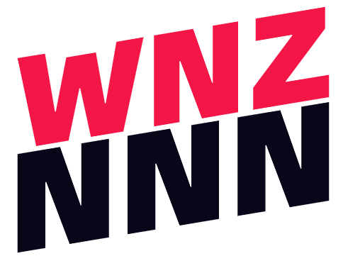

# 计算机网络Lab2

**2011269 王楠舟 计算机科学与技术**

## 实验要求

1. 搭建Web服务器（自由选择系统），并制作简单的Web页面，包含简单文本信息（至少包含专业、学号、姓名）和自己的LOGO。
2. 过浏览器获取自己编写的Web页面，使用Wireshark捕获浏览器与Web服务器的交互过程，并进行简单的分析说明。

## 实验环境

服务器搭建：SpringBoot、WebStrom（简单很多）

WireShark运行环境：本地Windows系统

## 实验步骤

### 一、Web服务器的搭建

我的Web服务器直接用了`SpringBoot`这个框架，在`Intellij IDEA`里新建一个`SpringBoot`项目搭建一个很简单的Web服务器，项目的框架如下图所示。


更简单的是直接使用`WebStrom`，`WebStrom`在启动时会在后台自动给你开一个Web服务器，比`SpringBoot`更直观好用，所以后续分析都是基于`WebStrom`做的。


`WebStrom`项目使用的默认端口号：


### 二、Web网页设计（HTML）

```html
<!DOCTYPE html>
<html lang="en">
<head>
    <meta charset="UTF-8">
    <title>王楠舟 实验二</title>
</head>
<body>
    <div style="text-align:center;">
        <p>
            姓名:王楠舟<br><br>
            学号:2011269<br><br>
            专业:计算机科学与技术<br>
        </p>
        
    </div>
</body>
</html>
```

`html`文档如上，该网页包含三条简单的文本信息（我的姓名、学号、专业），以及一张`png`格式的LOGO图片，最后网页效果如图所示：


### 三、WireShark抓捕过程

首先我们启动`WireShark`后，需要选择监听的网卡。但我电脑上网卡选项很多，所以我一开始在这里卡了很久，就因为不知道选择哪个网卡。最后是查阅资料得知，由于我们搭建的服务器在本机，所以实际上是本机和本机之间的通信，而一般本机网络通信使用的都是环回网卡，即下图中圈出的`loopback`。


双击选择后`WireShark`开始捕获，我们使用`Chrome`浏览器输入我们网页地址`localhost:63342/myWeb.html`，随后在`WireShark`中能显示出捕获到的交互信息。

然后为了方便分析，我们在过滤器设置一下我们的服务器端口号(63342)，过滤出与服务器交互的消息。最后成功显示出我们捕获的浏览器和服务器交互内容，如下。


### 四、交互过程分析

抓包结构大致分析：


抓到的TCP数据包基本都是如上图一样的结构，其中第一行文字`Frame 231`指出这是这次抓包过程中抓到的第231个分组信息，是物理层的数据帧概况；第二行`NULL/Loopback`指明使用的网卡，是属于数据链路层的信息；第三行`Internet Protocol Version 4`是网络层的信息，是IP包头部信息；第四行`Transmission Control Protocol`是传输层的数据段头部信息，在我们实验中都是使用`TCP`协议；第五行`Hypertext Transfer Protocol`，属于应用层信息，实验中是HTTP协议。

#### TCP三次握手

首先分析浏览器和服务器建立连接的过程，即TCP的三次握手过程。首先我们对TCP三次握手必须有一定了解：

- 第一次握手：客户端发送`SYN`报文到服务器，客户端进入`SYN_SEND`状态；
- 第二次握手：服务器收到客户端的`SYN`报文后需要回复一个`SYN`报文，并且给客户端一个`ACK`报文表示接受到了客户端的`SYN`，服务器进入`SYN_REVD`状态；
- 第三次握手：客户端收到 `SYN `报文之后，会发送一个 `ACK` 报文，客户端进入 `ESTABLISHED` 状态，服务器收到 `ACK` 报文之后，也进入` ESTABLISHED` 状态，从而顺利建立TCP连接。

所以，我们需要找的就是`[SYN],[SYN,ACK],[ACK]`这三次报文传输过程，就是TCP三次握手过程。很快我们定位到下图的位置。


为什么会有两个TCP连接？可以看到，浏览器发出请求时附带的`Http`版本是`1.1`，而`Http1.1`由于是基于文本协议的问答有序模式，所以会出现队头阻塞的问题，浏览器为了避免队头阻塞导致的访问延迟，所以会建立多个TCP连接，在这里建立了两个，端口号分别是55108和55109。

由于我们的网页比较简单，实际上只用到了55108端口这一个TCP连接，所以在后面我们过滤出`tcp.port == 66342 && tcp.port == 55108`的交互消息。接下来我们对TCP三次握手之间的交互进行详细解析。

**第一次握手**过程如下图，可以看到客户端（`Src:127.0.0.1 Source Port:55108`）向服务器（`Det:127.0.0.1 Destination Port:63342`）发送一个`SYN`报文（Flags：0x002），并且用户向服务器指明客户端的初始化序列号`Sequence Number`，客户端进入`SYN_SEND`状态.并且我们能注意到，握手过程发送`SYN`报文TCP的数据段长度是0（`TCP Segment Len:0`）；


**第二次握手**过程如下。服务器接收到用户的TCP连接请求的第一次握手后，进行相应，即第二次握手。服务器会以自己的 SYN 报文作为应答，并且也是指定了自己的初始化序列号。同时会把客户端的序列号+ 1（`3480948131`）作为`ACK` 的值，表示自己已经收到了客户端的 `SYN`，并且TCP报文中`Flags`被标志成了`SYN`和`ACK`，代表了服务器接收到用户建立连接的请求且允许和该用户建立TCP连接，此时服务器处于 `SYN_REVD` 的状态；


**第三次握手**过程如下。客户端收到`SYN` 报文后，给服务器发送一个`ACK`报文，一样把服务器的序列号 + 1作为 `ACK`的值，表示已经收到了服务端的 SYN 报文，此时客户端进入`ESTABLISHED`状态；服务器收到`ACK`报文之后，也处于`ESTABLISHED`状态，从而用户端和服务器端建立起了连接。


*个人疑惑：为什么三次握手的连接过程在Lab1没有体现出来，SOCKET编程里只看到了connect和accept；Answer：在socket编程中，客户端执行connect()时，收到服务器端accept消息后，触发第三次握手。*

#### 获取网页内容

在三次握手后，浏览器通过建立好的TCP连接向服务器发出HTTP请求。


可以看到，发送的是一个GET请求，其中`Lab2/myWeb.html`是我们想访问的页面，`HTTP/1.1`是指定的HTTP协议号。在这里主要对应用层内容做分析，如下图。


HTTP报文中，第一行`GET /Lab2/myWeb.html HTTP/1.1\r\n`称为**请求行**，由请求方法（对应`GET`）、URL（对应`Lab2/myWeb.html`）和HTTP协议版本（对应`HTTP/1.1`）三个部分组成；其后继第二行`Host:localhost:63342\r\n`被称为首部行，指明了HTTP访问的对象所在主机；`Connection:keep-alive\r\n`指明是持久连接，不要让服务器传输完就断开；`sec-ch-ua`中指明了用户代理为`Google Chrome`，即我们选择的浏览器；`sec-ch-ua-platform`则指出用户系统是`Windows`，等等。

接下来分析HTTP请求资源报文传输完成后，用户端和服务器端的TCP连接要干什么。


可以看到，服务器端先是对用户端的请求动作回应一个`ACK`表示收到，然后服务器将不包含网页资源的HTTP报文回应作为TCP的数据，传输回用户端，因为TCP有数据传输，所以可以看到`FLAGS`字段包含`PSH`，等待用户端回应`ACK`报文后服务器再把包含用户申请访问资源的HTTP报文回应作为TCP的数据，再一次传输给用户端。

**为什么需要将HTTP头先传输一次？**我的思考是，由于HTTP协议中头信息的HTTP体总是一起传输的，用户需要接收到完整的HTTP报文后解析HTTP头分析是不是有错误等，如果出错且HTTP体包含的数据较大，就会导致用户端响应较慢；所以将HTTP头单独传输一次，有用户端先分析这次请求能不能拿到正确结果，如果失败直接显示错误信息，不需要让服务器传输HTTP体，减小延迟。

接下来分析服务器的响应报文。第一行初始行指示服务器使用的也是`HTTP/1.1`，并且向用户返回状态码`200`说明一切正常，找到了用户请求访问的资源。


最后在实体体部分可以看到，我写的HTML文档被完全地传输了过来。


由于用户收到的HTML文档还需要访问图片LOGO资源，所以用户端会再一次向服务器申请获取`LOGO.PNG`这个资源。然后服务器再通过HTTP协议将PNG图片返回给用户。


文字和图片的传输基本一致，因为图片也是以二进制形式传输，只不过请求头和响应头都会进行一个标识。下图可以看到，HTTP在图片传输时会有讲传输内容的类型这个字段设置为`image/png`，说明传输的是一个PNG格式的图片资源。


最后传输格式也和直接传输HTML文档不一样，PNG有自己的传输格式，例如PNG签名等。


#### TCP四次挥手

最后TCP之间断开连接需要四次挥手，我们定位到四次挥手的位置，进行解析。


**第一次挥手：**客户端发送一个`FIN`报文，报文中会指定一个客户端序列号，停止发送数据，主动关闭TCP连接，客户端进入`FIN_WAIT_1`状态；


**第二次挥手：**服务端收到`FIN`之后，会发送`ACK`报文，并且把客户端的序列号值 +1作为`ACK`报文的序列号值，表明已经收到客户端的报文了（**上图的序列号`3480949678`+1即是服务器`ACK`报文的序列号值`3480949679`**），此时服务端进入`CLOSE_WAIT`状态。此时的TCP处于半关闭状态，客户端收到服务端的确认后，进入`FIN_WAIT_2`状态，等待服务端发出的连接释放报文段;


**第三次挥手：**和客户端的第一次挥手一样，给客户端发送`FIN`报文，且指定一个序列号。此时服务端处于`LAST_ACK`的状态;


**第四次挥手：**客户端收到`FIN`后，发送`ACK`报文回应，且把服务端的序列号值 +1 作为自己`ACK`报文的序列号值（即服务器序列号`1124115294+1=1124115295`），客户端进入`TIME_WAIT`状态，确保服务端收到`ACK`报文之后才会进入`CLOSED`状态；服务端收到`ACK`报文之后，就进入`CLOSED`状态。

